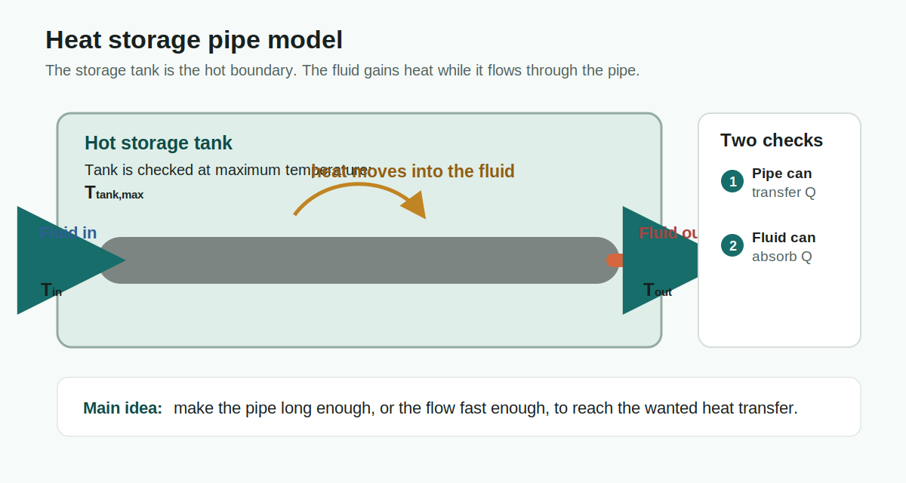
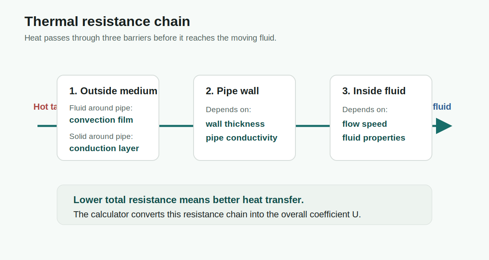
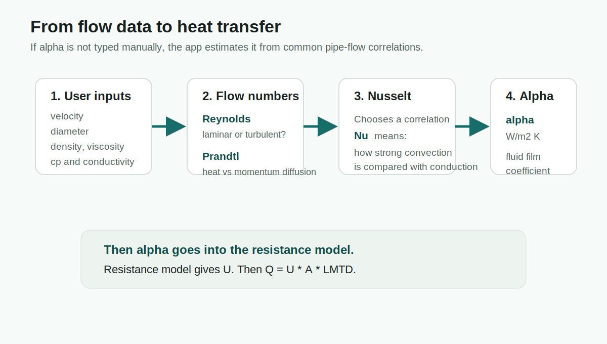

# Heat Exchange Calculator

Browser-based calculator for heat transfer from a hot storage tank through a pipe wall into a fluid flowing inside the pipe.

## Current Model

### Physics Overview



The primary heat-transfer equation is:

```text
Q = U * A * LMTD
```

Where:

- `Q` is heat transfer rate in W.
- `U` is the overall heat exchange coefficient in W/m2 K.
- `A` is the outside pipe surface area in m2.
- `LMTD` is the log mean temperature difference between tank temperature and pipe-fluid inlet/outlet temperatures.

For the hot storage tank boundary:

```text
deltaT1 = T_tank_max - T_fluid_in
deltaT2 = T_tank_max - T_fluid_out
LMTD = (deltaT1 - deltaT2) / ln(deltaT1 / deltaT2)
```

The fluid-side energy check is:

```text
Q_fluid = mass_flow * cp * (T_fluid_out - T_fluid_in)
```

The inside heat-transfer coefficient is estimated from Reynolds, Prandtl, and Nusselt numbers when manual alpha is blank.

### Thermal Resistance Model



The calculator treats the pipe as a cylindrical heat-transfer path. The total thermal resistance is:

```text
R_total = R_outside + R_wall + R_inside
```

Inside convection:

```text
R_inside = 1 / (alpha_i * A_i)
A_i = pi * D_i * L
```

Pipe wall conduction:

```text
R_wall = ln(D_o / D_i) / (2 * pi * k_pipe * L)
D_o = D_i + 2 * wall_thickness
```

Outside medium:

```text
Fluid outside: R_outside = 1 / (alpha_o * A_o)
Solid outside: R_outside = ln(D_s / D_o) / (2 * pi * k_medium * L)
A_o = pi * D_o * L
```

Overall coefficient:

```text
U = 1 / (R_total * A_o)
U * A_o = 1 / R_total
```

### Nusselt And Alpha Estimate



When a manual alpha value is not provided, the calculator estimates alpha from fluid properties and flow:

```text
Re = velocity * diameter / nu
Pr = cp * rho * nu / k
alpha = Nu * k / diameter
```

Where:

- `Re` is Reynolds number.
- `Pr` is Prandtl number.
- `Nu` is Nusselt number.
- `nu` is kinematic viscosity in m2/s internally. The UI accepts mm2/s and converts it.
- `alpha` is the convection coefficient in W/m2 K.

Nusselt estimate used in the current version:

```text
Laminar flow: Nu = 3.66
Turbulent flow: Nu = 0.023 * Re^0.8 * Pr^n
n = 0.4 when the fluid is being heated
n = 0.3 when the fluid is being cooled
```

For transition flow between `Re = 2300` and `Re = 10000`, the app blends between the laminar and turbulent estimates. This is useful for simulation, but final engineering design should verify the correlation against the real geometry and operating range.

## Features

- Three input groups: fluid in pipe, pipe, and medium around pipe.
- Temperature units can be changed between Celsius, Kelvin, and Fahrenheit.
- Fluid and material presets are editable after selection.
- Missing or invalid inputs are highlighted and listed by group.
- Solver can calculate heat rate, overall coefficient, fluid temperature rise, pipe length, outlet temperature, fluid velocity, and outside alpha.
- Velocity sweep table for simulation.
- Project profiles such as `House` and `Power facility`, each with separate saved experiments.
- Saved experiments use browser local storage for now.

## Run Locally

Open `index.html` directly in a browser, or run the static server:

```bash
npm start
```

Then open:

```text
http://localhost:8090
```

Use a different port:

```bash
PORT=3000 npm start
```

## Linux Server

Copy this folder to the server, install Node.js 18 or newer, then run:

```bash
npm start
```

For a persistent service, run it behind Nginx or a process manager such as systemd or pm2. The app listens on `0.0.0.0` by default and uses `PORT=8090` unless another port is set.

## Docker

```bash
docker build -t heat-exchange-calculator .
docker run -p 8090:8090 heat-exchange-calculator
```

## GitHub

From this folder:

```bash
git init
git add .
git commit -m "Initial heat exchange calculator"
git branch -M main
git remote add origin <your-github-repo-url>
git push -u origin main
```

## Formula References

- LMTD: https://en.wikipedia.org/wiki/Logarithmic_mean_temperature_difference
- Nusselt number and pipe-flow correlations: https://en.wikipedia.org/wiki/Nusselt_number

For engineering use, verify selected correlations and material properties against design standards or manufacturer data before committing to hardware.
